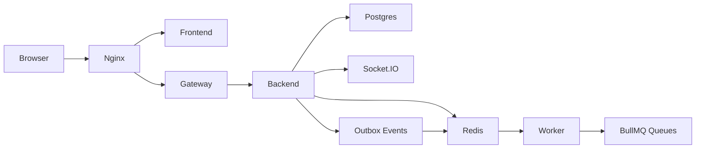

# Architecture Diagram

## Notes
- Tenant isolation is enforced by `tenantId` on all core records.
- Redis is used for cache, pub/sub, Socket.IO adapter, and BullMQ queues.
- CQRS is represented by write endpoints plus optimized summary/report read models.
